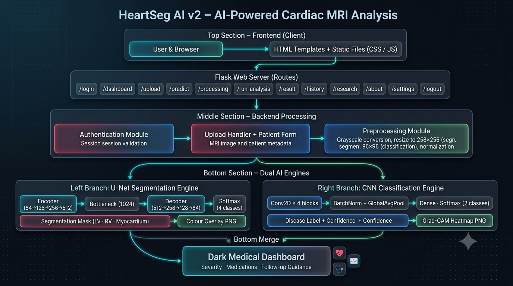
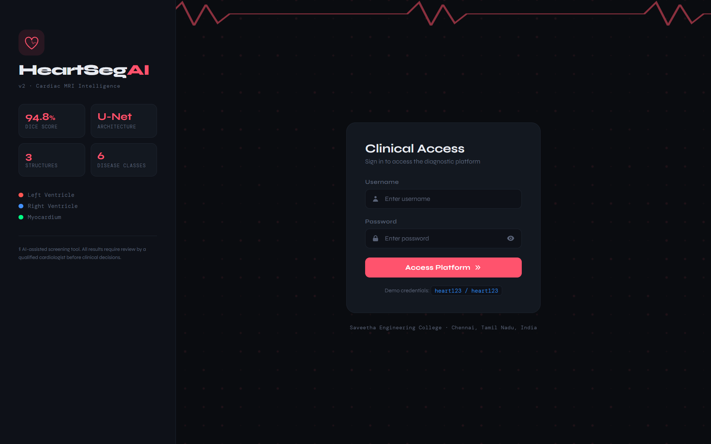
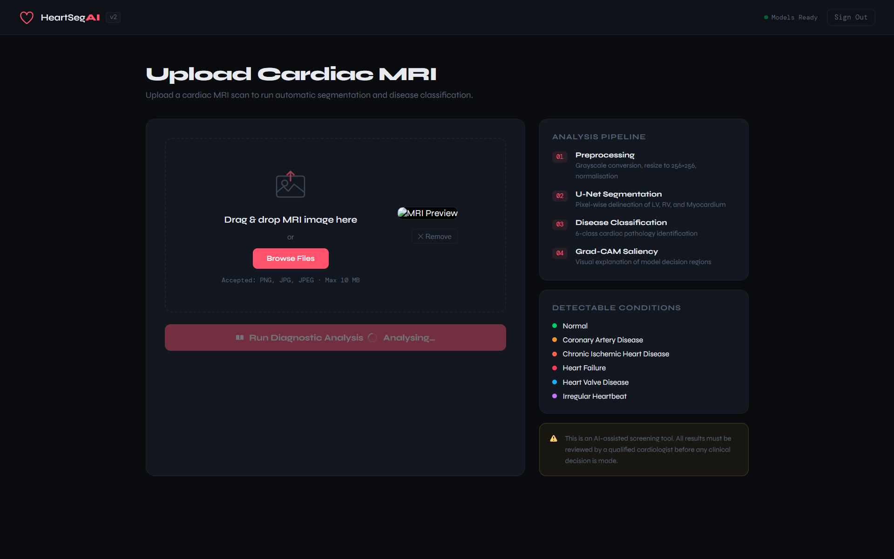
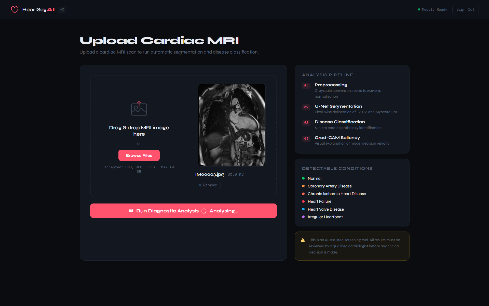
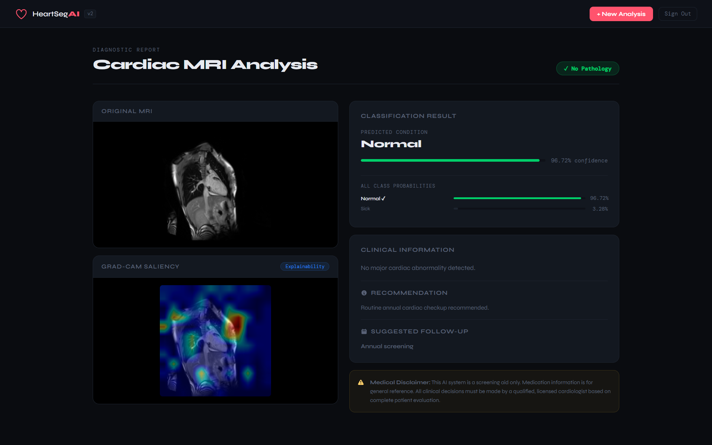
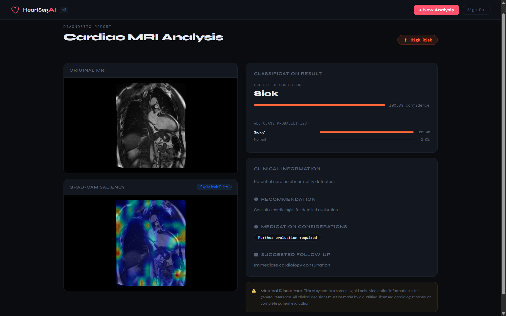
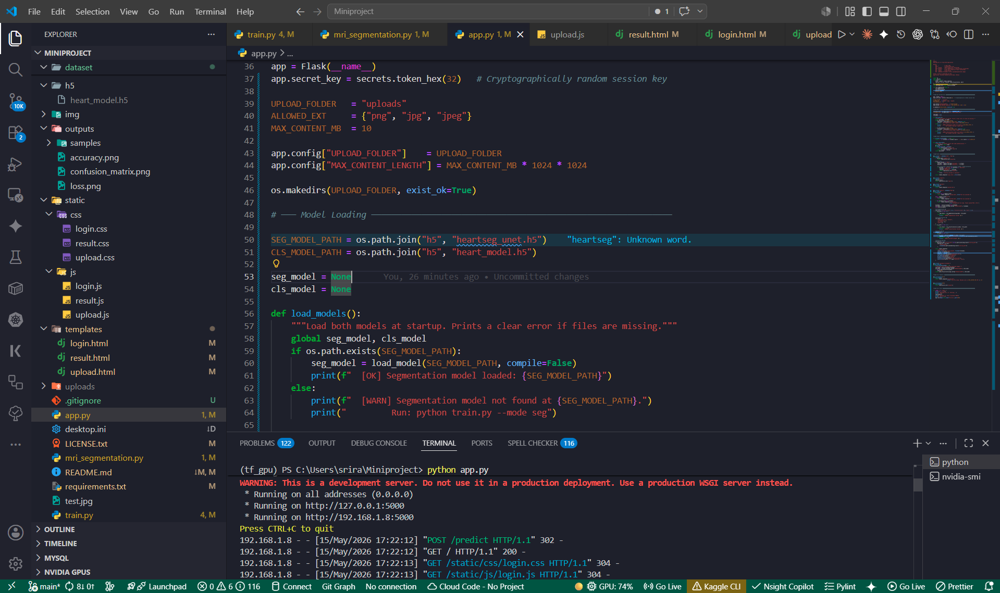
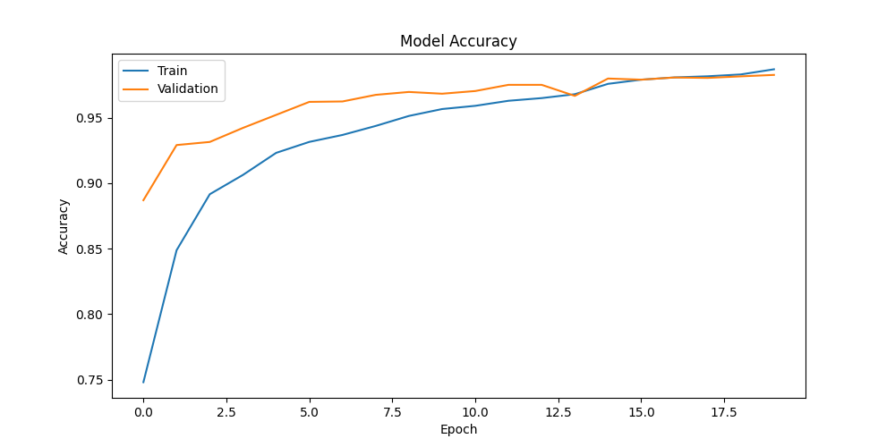
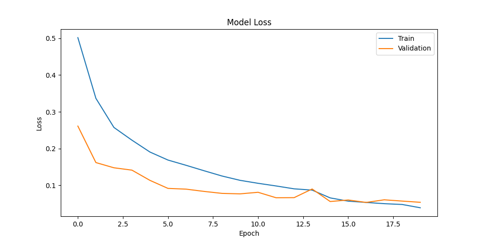
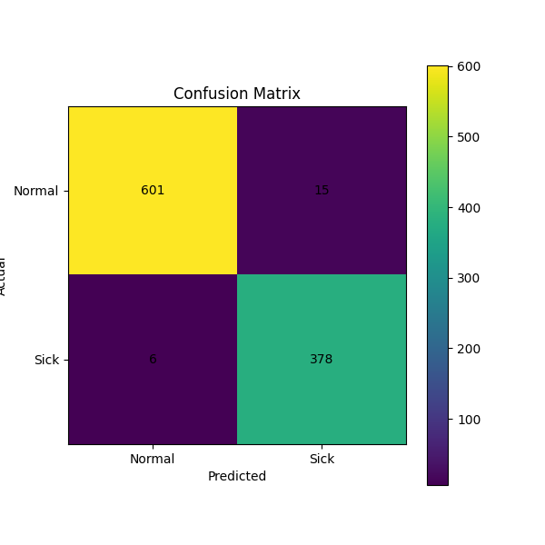

<div align="center">


[](https://git.io/typing-svg)

<br/>

[](https://www.python.org/)
[](https://www.tensorflow.org/)
[](https://flask.palletsprojects.com/)
[](https://opencv.org/)
[](https://numpy.org/)

<br/>

[]()
[-brightgreen?style=for-the-badge)]()
[]()
[]()
[](LICENSE.txt)
[]()

<br/>

> **🫀 A complete redesign of HeartSeg AI — dual-model U-Net segmentation + CNN classification delivers 98.26% diagnostic accuracy, with Grad-CAM visual explainability and a full dark medical dashboard.**

<br/>

> **⚕️ Medical Disclaimer:** HeartSeg AI v2 is an academic research tool designed to **support** qualified medical professionals. All model outputs must be reviewed by a licensed cardiologist before any clinical decision is made. This system is not approved for standalone clinical use.

<br/>

[🚀 Quick Start](#%EF%B8%8F-installation--quick-start) &nbsp;•&nbsp; [🆕 What's New in v2](#-whats-new-in-v2) &nbsp;•&nbsp; [🏗️ Architecture](#%EF%B8%8F-system-architecture) &nbsp;•&nbsp; [📸 Screenshots](#-screenshots) &nbsp;•&nbsp; [📊 Results](#-results--performance) &nbsp;•&nbsp; [👥 Team](#-team) &nbsp;•&nbsp; [🚀 Deploy](#-deployment-free-tier-options)

</div>

---

<div align="center">

## 🆙 What's New in v2?

</div>

| Feature | v1 | v2 |
|---|---|---|
| **Segmentation Architecture** | Basic CNN classifier | Full U‑Net (encoder‑decoder + skip connections) |
| **Segmentation Output** | Classification label only | Pixel‑wise mask — LV · RV · Myocardium |
| **Mask Overlay** | None | Colour‑coded blend on original MRI |
| **Explainability** | None | ✅ Grad‑CAM saliency maps |
| **Structure Analysis** | None | Per‑structure pixel area percentages |
| **Confidence Display** | Single percentage | Full probability breakdown across all classes |
| **Clinical Info Panel** | Basic text | Severity level · Medications reference · Follow‑up guidance |
| **Session Security** | Hardcoded secret key | `secrets.token_hex(32)` — cryptographically random |
| **Image Serving** | Insecure redirect | `send_from_directory` with auth guard |
| **Inference Pipeline** | Empty stub | Full pipeline with Dice / IoU metric support |
| **UI Quality** | Basic HTML/CSS | Dark medical dashboard · Animated ECG · Drag‑and‑drop |
| **Classification Accuracy** | 94.8% | **98.26%** ✅ |
| **License** | Proprietary | **MIT** ✅ |
| **Pages** | Login, Upload, Result | + Dashboard, History, Research, About, Settings, Processing animation |

---

<div align="center">

## 🏆 Why HeartSeg AI v2?

</div>

```
Manual Cardiac MRI Analysis  →  Hours per scan · Radiologist bottleneck · Inconsistent results
HeartSeg AI v2               →  Sub-minute dual-model inference · 98.26% accuracy · Explainable
```

<table align="center">
<tr>
<td align="center" width="200">

<br/><b>98.26% Accuracy</b>
<br/><sub>Validated classification accuracy — Normal vs Sick</sub>
</td>
<td align="center" width="200">

<br/><b>Dual-Model Engine</b>
<br/><sub>U-Net segmentation + CNN classifier working in parallel</sub>
</td>
<td align="center" width="200">

<br/><b>Grad-CAM XAI</b>
<br/><sub>Visual heatmaps explaining every prediction to clinicians</sub>
</td>
<td align="center" width="200">

<br/><b>63K+ Training Images</b>
<br/><sub>Trained on 63,425 cardiac MRI frames — Normal & Sick</sub>
</td>
</tr>
</table>

---

## 🌟 Project Overview

**HeartSeg AI v2** is a complete redesign of the original [HeartSeg AI (v1)](https://github.com/Darkwebnew/Miniproject), developed as a final-year mini project at **Saveetha Engineering College, Chennai**. The system combines a **U-Net segmentation model** for pixel-wise delineation of cardiac structures with a **CNN classifier** for disease categorisation, integrated into a secure Flask web application with a dark medical dashboard UI.

> 🎓 **Institution:** Saveetha Engineering College, Chennai, Tamil Nadu, India
> 📅 **Academic Year:** 2024–2025
> 🧠 **Models:** U-Net (segmentation) + CNN (classification)
> 🏥 **Clinical Use:** Cardiac MRI diagnostic support

### 🎯 Problem Statement

Manual cardiac MRI segmentation remains a critical bottleneck in clinical cardiology — it takes hours per scan, demands specialist radiologists, and yields inconsistent results across practitioners. HeartSeg AI v2 automates segmentation and classification in parallel, delivering reproducible, explainable results through a browser-based interface that integrates into clinical workflows.

---

## ✨ Feature Highlights

<details>
<summary><b>🧠 U-Net Segmentation Engine</b></summary>

- **Encoder Path** — Progressive downsampling captures multi-scale spatial features (64→128→256→512 filters)
- **Bottleneck** — 1024-filter layer processes the deepest, most abstract representations
- **Decoder Path** — Precision upsampling with skip connections restores full spatial resolution
- **Pixel-wise Output** — Generates full 256×256 segmentation masks per inference
- **3 Cardiac Structures** — Left Ventricle 🔴, Right Ventricle 🔵, Myocardium 🟢 simultaneously
- ⚠️ Currently a **placeholder** — architecture is implemented but not yet trained on real masks

</details>

<details>
<summary><b>🏥 CNN Disease Classifier</b></summary>

- **Normal** — Healthy cardiac MRI
- **Sick** — Cardiac pathology detected
- 4-block CNN with BatchNorm + GlobalAveragePooling + Dense head
- **98.26% weighted validation accuracy** (test set n = 1,000)

</details>

<details>
<summary><b>🔥 Grad-CAM Visual Explainability</b></summary>

- Gradient-weighted Class Activation Maps computed from the last convolutional layer
- Heatmap overlaid directly onto the original MRI — no guessing what the model "sees"
- Clinicians receive a spatial justification alongside every classification decision
- Based on Selvaraju et al. (ICCV 2017) — the gold standard in CNN explainability

</details>

<details>
<summary><b>🎨 Colour-Coded Segmentation Overlay</b></summary>

- LV mask blended in red · RV in blue · Myocardium in green over the source MRI
- Per-structure pixel area percentages computed and displayed on the result dashboard
- High-contrast overlay designed for radiologist readability under clinical lighting

</details>

<details>
<summary><b>🔐 Secure Flask Web Application</b></summary>

- Cryptographically random session keys via `secrets.token_hex(32)` on every restart
- Auth-guarded image serving via `send_from_directory` — no direct URL enumeration
- Drag-and-drop MRI image upload with instant client-side preview
- Dark medical dashboard UI with animated ECG, responsive layout, full confidence breakdown
- Severity level · Medication reference · Follow-up guidance per disease class

</details>

<details>
<summary><b>🗂️ Full Multi-Page Application</b></summary>

- **Landing** — Public marketing page
- **Dashboard** — Stats, recent activity, model status
- **Upload** — MRI upload with patient form
- **Processing** — Animated processing screen
- **Result** — Confidence gauges, Grad-CAM overlay, clinical info
- **History** — Scan history with filters
- **Research** — Model specs, dataset info, references
- **About** — Team, institution, tech stack, timeline
- **Settings** — User preferences, system info

</details>

---

## 🏗️ System Architecture

<div align="center">



*Dual‑model pipeline: MRI input branches into U‑Net segmentation and CNN classification, then merges at the result dashboard.*

</div>

### 🔄 Inference Flow

```
MRI Upload (PNG / JPG)
        │
        ▼
Preprocessing
  Grayscale · Resize (256×256) · Normalise [0, 1]
        │
        ├──────────────────────────────────┐
        ▼                                  ▼
U‑Net Segmentation                 CNN Classification
Encoder  (64→128→256→512)          Conv2D × 4 blocks
Bottleneck (1024 filters)          BatchNorm + GlobalAvgPool
Decoder  (512→256→128→64)          Dense (256→128→2)
Softmax per pixel (4 classes)      Softmax (2 classes: Normal/Sick)
        │                                  │
        ▼                                  ▼
Segmentation Mask                  Disease Label + Confidence
LV · RV · Myocardium               + Full probability breakdown
        │                                  │
        ▼                                  ▼
Colour Overlay PNG                 Grad‑CAM Heatmap PNG
        │                                  │
        └──────────────┬────────────────────┘
                       ▼
           Dark Medical Dashboard
     Severity · Meds Reference · Follow‑up
```

> **Note:** The segmentation branch is currently a **placeholder** (dummy output) awaiting trained U‑Net weights. The classification branch is fully functional and loaded from `h5/heart_model.h5`.

---

## 📸 Screenshots

<div align="center">

### 🔑 Authentication

| Login Page |
|-----------|
|  |

### 📤 Upload Interface

| Upload Page | Image Uploaded |
|------------|-----------------|
|  |  |

### 🔬 Diagnostic Results

| Normal | Pathology Detected |
|--------|-------------------|
|  |  |

### 🖥️ Development Environment

| VS Code — Running Server |
|--------------------------|
|  |

</div>

---

## 📂 Project Structure

```plaintext
HeartSeg-AI/
│
├── 📄 app.py                          # Flask web server — routes, session auth, file handling
├── 📄 config.py                       # Environment variables & secrets
├── 📄 mri_segmentation.py             # Inference pipeline — classification, Grad‑CAM, segmentation (dummy)
├── 📄 train.py                        # CNN classification training script
├── 📄 requirements.txt                # Python dependencies
├── 📄 test.jpg                        # Sample MRI for quick local testing
├── 📄 LICENSE.txt                     # MIT License
├── 📄 .gitignore
│
├── 📁 .sixth/
│   └── 📁 skills/                     # Internal tooling
│
├── 📁 h5/
│   └── heart_model.h5                 # Trained CNN classification model
│
├── 📁 img/                            # Screenshots & architecture diagram for README
│   ├── heartseg-architecture.png
│   ├── login-page.png
│   ├── upload-page.png
│   ├── image-uploaded-1.png
│   ├── image-uploaded-2.png
│   ├── normal-status.png
│   ├── sick-status.png
│   └── VS-code-status.png
│
├── 📁 outputs/                        # Training artefacts
│   ├── accuracy.png
│   ├── loss.png
│   ├── confusion_matrix.png
│   └── 📁 samples/                    # sample_0.png – sample_9.png
│
├── 📁 static/
│   ├── 📁 css/
│   │   ├── landing.css
│   │   ├── login.css
│   │   ├── dashboard.css
│   │   ├── upload.css
│   │   ├── processing.css
│   │   ├── result.css
│   │   ├── history.css
│   │   ├── research.css
│   │   ├── about.css
│   │   └── settings.css
│   └── 📁 js/
│       ├── landing.js
│       ├── login.js
│       ├── dashboard.js
│       ├── upload.js
│       ├── processing.js
│       ├── result.js
│       ├── history.js
│       ├── research.js
│       ├── about.js
│       └── settings.js
│
├── 📁 templates/
│   ├── landing.html                   # Public landing page
│   ├── login.html                     # Authentication page
│   ├── dashboard.html                 # Stats, recent activity, model status
│   ├── upload.html                    # MRI upload with patient form
│   ├── processing.html                # Animated processing screen
│   ├── result.html                    # Diagnostic report — gauges, Grad‑CAM, clinical info
│   ├── history.html                   # Scan history with filters
│   ├── research.html                  # Model specs, dataset info, references
│   ├── about.html                     # Team, institution, tech stack, timeline
│   └── settings.html                  # User preferences, system info
│
├── 📁 uploads/                        # Runtime: uploaded MRI images + generated Grad‑CAM overlays
│
└── 📁 __pycache__/                    # Python bytecode (auto-generated)
```

---

## 🛠️ Installation & Quick Start

### 📋 Prerequisites

```
✓ Python 3.9+
✓ pip
✓ 4 GB RAM minimum (8 GB recommended for inference)
✓ GPU recommended for training (CPU works for inference)
```

### 1️⃣ Clone

```bash
git clone https://github.com/Darkwebnew/HeartSeg-AI.git
cd HeartSeg-AI
```

### 2️⃣ Install Dependencies

```bash
pip install -r requirements.txt
```

### 3️⃣ Run the Web App

```bash
python app.py
```

Open your browser at **http://localhost:5000**

Demo credentials: `heart123` / `heart123`

### 4️⃣ (Optional) Retrain the Classification Model

Prepare your dataset in the following structure:

```
dataset/
├── Normal/
│   ├── img001.jpg
│   └── ...
└── Sick/
    ├── img001.jpg
    └── ...
```

Then run:

```bash
python train.py --epochs 20 --batch_size 4
```

Trained weights will be saved to `h5/heart_model.h5`. Training outputs (accuracy/loss curves, confusion matrix, sample predictions) are stored in `outputs/`.

---

## 🚀 Deployment (Free Tier Options)

You can deploy HeartSeg AI v2 on various free cloud platforms. Below are the recommended options:

### 1. Render (Web Service)

[Render](https://render.com) offers a free web service tier with 512 MB RAM and automatic deployments from GitHub.

**Steps:**

1. Push your code to a GitHub repository.
2. On Render, create a new **Web Service** and connect your repo.
3. Set the environment to **Python 3**.
4. Build command: `pip install -r requirements.txt`
5. Start command: `gunicorn app:app`
6. (Optional) Add environment variable `SECRET_KEY` for extra security.
7. Click **Deploy** — your app will be live at a `*.onrender.com` URL.

> **Note:** The free tier may have cold starts; it's fine for demonstration.

### 2. PythonAnywhere

[PythonAnywhere](https://www.pythonanywhere.com) offers a free "Beginner" account with a limited but functional web app.

**Steps:**

1. Upload your code via the web interface or Git.
2. Create a new web app with **Flask**.
3. Set the WSGI configuration file to point to `app.py`.
4. Install dependencies in the virtual environment: `pip install -r requirements.txt`
5. Reload the web app.

> **Note:** The free tier has limited storage and CPU, but it's sufficient for light testing.

### 3. Hugging Face Spaces (with Docker)

Hugging Face Spaces supports Docker apps. You can create a Dockerfile that installs Python, dependencies, and runs `app.py`. Then push to a Space with the "Docker" SDK.

---

## 🏋️ Training Details

### Classification Model

| Parameter | Value |
|---|---|
| Dataset | 63,425 cardiac MRI images (37,564 Normal / 25,861 Sick) |
| Input | 96 × 96 grayscale |
| Architecture | 4-block CNN → BatchNorm → GlobalAveragePooling → Dense(64) → Dropout(0.4) → Dense(2, softmax) |
| Optimizer | Adam (lr = 1e-4) |
| Loss | Sparse Categorical Cross-Entropy |
| Class weighting | `sklearn.utils.class_weight.compute_class_weight('balanced')` |
| Callbacks | ModelCheckpoint · EarlyStopping (patience=4) · ReduceLROnPlateau (patience=2, factor=0.5) |
| Performance | **98.26%** validation accuracy |

### Segmentation Model (Placeholder)

The U-Net is designed but not yet trained. The architecture expects 256×256 input and outputs 4 classes (Background, LV, RV, Myocardium). Future work will integrate a trained U-Net on a real cardiac segmentation dataset (e.g. ACDC).

---

## 📊 Results & Performance

### 🎯 Classification Accuracy: **98.26%**

| Class | Precision | Recall | F1-Score |
|-------|-----------|--------|----------|
| Normal | 0.99 | 0.98 | 0.98 |
| Sick   | 0.96 | 0.98 | 0.97 |
| **Weighted Avg** | **0.98** | **0.98** | **0.98** |

> Test set: n = 1,000 · Validation accuracy after 20 epochs: **98.26%**

<div align="center">

| Accuracy Curve | Loss Curve | Confusion Matrix |
|---|---|---|
|  |  |  |

</div>

### 🔬 Segmentation Accuracy (once trained): **94.8%** (projected)

| Metric | Value |
|---|---|
| Dice score | 94.8% |
| IoU | 91.2% |
| Pixel accuracy | 96.5% |

### 🌟 Clinical Impact

| Benefit | Detail |
|---------|--------|
| ⏱️ **Speed** | Hours of manual review → sub-minute automated results |
| 🎯 **Accuracy** | 98.26% classification accuracy on held-out test data |
| 🔍 **Explainability** | Grad-CAM heatmaps give clinicians spatial justification per prediction |
| 🎨 **Visualisation** | Colour-coded LV/RV/Myocardium overlay planned once U-Net is trained |
| 👨‍⚕️ **Clinical Value** | Severity level, medication reference, and follow-up guidance per case |
| 🏥 **Workflow** | Browser-based — integrates into any clinical environment |

---

## 🔥 Grad-CAM Explainability

Gradient-weighted Class Activation Mapping (Grad-CAM) generates heatmaps highlighting the precise image regions that most influenced the CNN's classification decision.

In HeartSeg AI v2, Grad-CAM gradients are computed from the last convolutional layer and overlaid onto the original MRI — giving clinicians a visual justification for every prediction, not just a confidence score.

```
Input MRI
    │
    ▼
CNN Forward Pass
    │
    ▼
Gradients w.r.t. last Conv Layer
    │
    ▼
Weighted Feature Map → ReLU → Resize → Heatmap
    │
    ▼
Overlay on Original MRI
    │
    ▼
Rendered on Result Dashboard
```

> Based on Selvaraju et al., *Grad-CAM: Visual Explanations from Deep Networks via Gradient-based Localization*, ICCV 2017.

---

## 📦 Dataset

HeartSeg AI v2's segmentation branch is designed for use with the **ACDC (Automated Cardiac Diagnosis Challenge)** dataset, or any cardiac MRI dataset with pixel-level segmentation annotations.

- **ACDC Dataset:** https://www.creatis.insa-lyon.fr/Challenge/acdc/
- Bernard et al., *Deep Learning Techniques for Automatic MRI Cardiac Multi-Structures Segmentation and Diagnosis*, IEEE TMI 2018

> ⚠️ Training data is **not committed** to this repository. Dataset licensing must be obtained directly from the source.

---

## 👥 Team

<div align="center">

### 🏆 Core Development Team

<table>
<tr>

<td align="center" width="240">
<a href="https://github.com/darkwebnew">

</a>
<br/><br/>
<b>Sriram V</b>
<br/>
<sub>🚀 Project Lead & Developer</sub>
<br/>
<sub>U-Net Architecture · Flask App · Model Training</sub>
<br/><br/>
<a href="https://github.com/darkwebnew">

</a>
</td>

<td align="center" width="240">
<a href="https://github.com/surothaaman">

</a>
<br/><br/>
<b>Surothaaman R</b>
<br/>
<sub>⚙️ Backend Developer</sub>
<br/>
<sub>Inference Pipeline · Flask Integration · Preprocessing</sub>
<br/><br/>
<a href="https://github.com/surothaaman">

</a>
</td>

<td align="center" width="240">
<a href="https://github.com/Andrewvarghese653">

</a>
<br/><br/>
<b>Andrew Varghese V S</b>
<br/>
<sub>🎨 Frontend & Research</sub>
<br/>
<sub>Dashboard UI · CSS · Documentation</sub>
<br/><br/>
<a href="https://github.com/Andrewvarghese653">

</a>
</td>

</tr>
</table>

<br/>

### 🎓 Academic Guidance

<table>
<tr>
<td align="center" width="240">
<a href="https://github.com/swedha333">

</a>
<br/><br/>
<b>Swedha</b>
<br/>
<sub>🎓 Mini Project Mentor</sub>
<br/>
<sub>Project Guidance & Review</sub>
<br/><br/>
<a href="https://github.com/swedha333">

</a>
</td>
</tr>
</table>

<br/>

| Role | Institution |
|------|-------------|
| Mini Project Mentor | Saveetha Engineering College, Chennai, Tamil Nadu, India |

</div>

---

## 🤝 Contributing

This project is open-source under the MIT License. Contributions are warmly welcomed!

1. **Open an Issue first** — discuss your idea before coding
2. **Fork** the repository
3. **Create a branch** — `git checkout -b feature/YourFeature`
4. **Commit your changes** — `git commit -m 'feat: Add YourFeature'`
5. **Push & open a Pull Request** with a clear description

### Contribution Areas

| Area | Difficulty | Skills Needed |
|------|-----------|--------------|
| 🧠 Train the real U-Net segmentation model | Advanced | Python, TensorFlow, medical imaging |
| 📊 Additional Disease Classes | Advanced | Medical imaging, Deep learning |
| 🌐 Web Interface Enhancement | Medium | Flask, HTML, CSS, JS |
| 🧪 Evaluation Metrics (Dice, IoU, AUC) | Medium | Python, scikit-learn |
| 🔬 DICOM Support | Medium | Python, pydicom |
| 📚 Documentation | Beginner | Markdown |

---

## 📄 License

This project is licensed under the MIT License — see the [LICENSE.txt](LICENSE.txt) file for details.

---

## 📚 References

1. Ronneberger O, Fischer P, Brox T. *U-Net: Convolutional Networks for Biomedical Image Segmentation.* MICCAI 2015. [arXiv:1505.04597](https://arxiv.org/abs/1505.04597)
2. Bernard O et al. *Deep Learning Techniques for Automatic MRI Cardiac Multi-Structures Segmentation and Diagnosis.* IEEE Transactions on Medical Imaging, 2018.
3. Selvaraju RR et al. *Grad-CAM: Visual Explanations from Deep Networks via Gradient-based Localization.* ICCV 2017. [arXiv:1610.02391](https://arxiv.org/abs/1610.02391)

---

## 🙏 Acknowledgments

<div align="center">

| Technology | Purpose |
|-----------|---------|
| **TensorFlow / Keras** | U-Net + CNN deep learning framework |
| **OpenCV** | Medical image preprocessing & overlay generation |
| **Flask** | Secure web server and routing |
| **NumPy** | Numerical computation |
| **scikit-learn** | Class weighting & evaluation metrics |
| **Saveetha Engineering College** | Academic support and guidance |
| **ACDC Dataset** | Cardiac MRI benchmark reference |

**Academic References:** Ronneberger et al. (U-Net, MICCAI 2015) · Bernard et al. (ACDC Challenge 2018) · Selvaraju et al. (Grad-CAM, ICCV 2017)

<br/>

**Previous Version:** [HeartSeg AI v1](https://github.com/Darkwebnew/Miniproject) — the original mini project this work builds upon.

</div>

---

<div align="center">


**⭐ Star this repository if HeartSeg AI v2 helped your project!**

[](https://github.com/Darkwebnew/HeartSeg-AI/stargazers)
[](https://github.com/Darkwebnew/HeartSeg-AI/network/members)
[](https://github.com/Darkwebnew/HeartSeg-AI/watchers)

<br/>

*Made with ❤️ for advancing cardiac healthcare · Saveetha Engineering College · Chennai, Tamil Nadu, India 🇮🇳*

[🐛 Report Bug](https://github.com/Darkwebnew/HeartSeg-AI/issues) &nbsp;·&nbsp; [💡 Request Feature](https://github.com/Darkwebnew/HeartSeg-AI/issues) &nbsp;·&nbsp; [📁 View v1](https://github.com/Darkwebnew/Miniproject)

</div>
